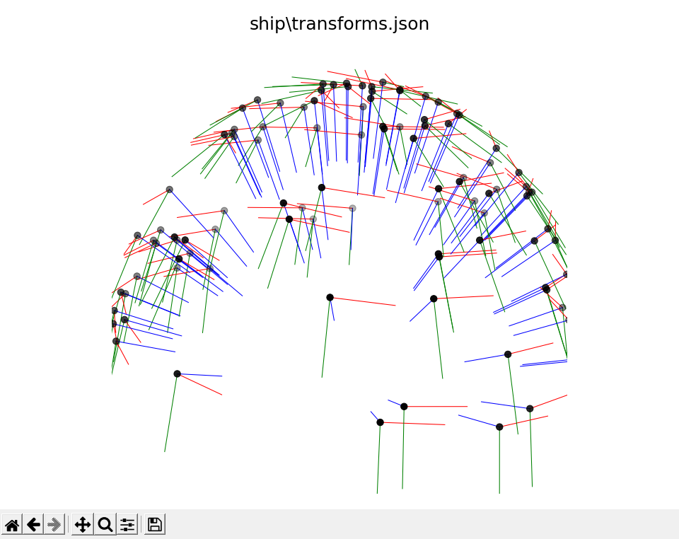

# metashape2instant-ngp
[**日本語**](./README.ja.md)

This repository contains the following programs.
* A program to form camera coordinate data in XML format, which can be obtained from the photogrammetry software [Metashape](https://www.agisoft.com/), into JSON format for input to [Instant NeRF](https://github.com/NVlabs/instant-ngp).

* visualize_json.py: Program to visualize camera coordinate data in JSON format to be input to Instant NeRF

* visualize_xml.py: A program to visualize camera coordinate data in XML format obtained from the photogrammetry software Metashape.


## Environment
* Python 3.10.6
* opencv-python 4.6.0
* matplotlib 3.5.3

# metashape2nerf.py
## Folder structure
```
.
├─ metashape2nerf.py
└─ <scene_dir>
   ├─ camera.xml
   └─ images
      └─ All images for which camera coordinates were obtained.
```
## Arguments
* `scene_dir`: The path to the directory of the scene you want to reproduce in Instant NeRF. In this directory, put `images`, which contains all the images for which the camera coordinates were obtained, and `camera.xml`, which is a file containing the camera coordinates obtained by Metashape.
* `recenter`: Option to align the center of gravity of the camera coordinates obtained by Metashape with the origin.

## Output
Output `transforms.json`, which is the camera coordinates from XML format to JSON format, to `scene_dir`.

## Example
```
python metashape2nerf.py --recenter ./fern
```

# visualize_json.py / visualize_xml.py
## Arguments
Path to JSON/XML file where camera coordinate data is stored.

## Example
```
python visualize_json.py ship\transforms.json
```




# Acknowledgements
This software was supported by JSPS Grant-in-Aid for Scientific Research (B)22H03710.